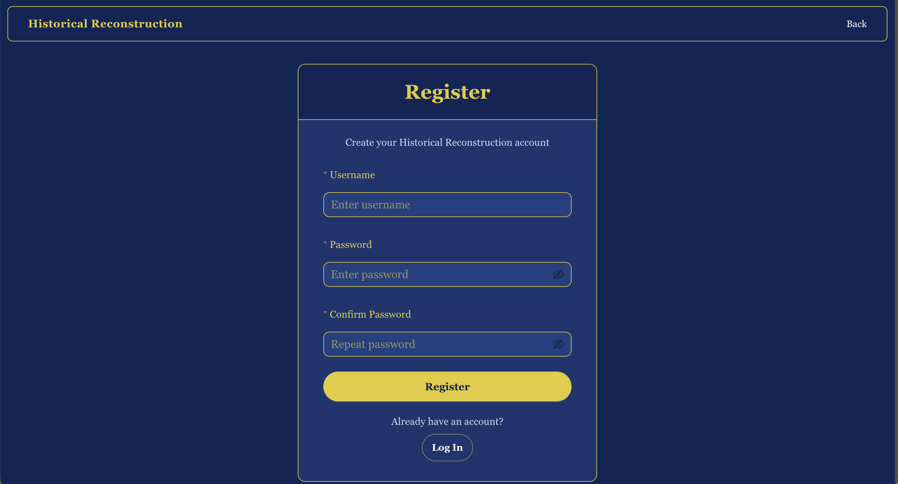
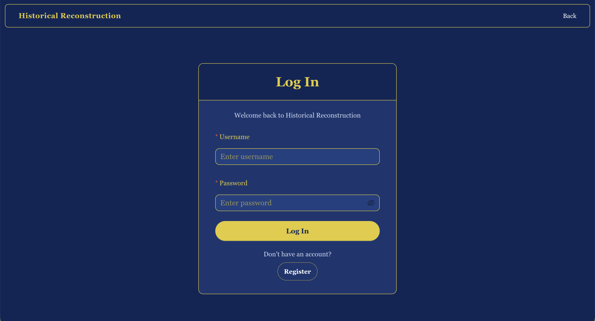
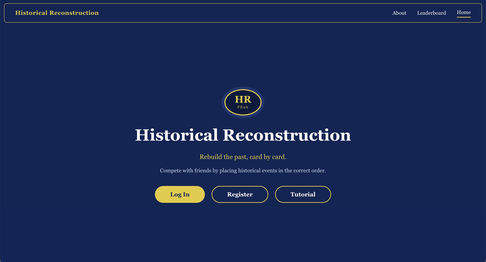
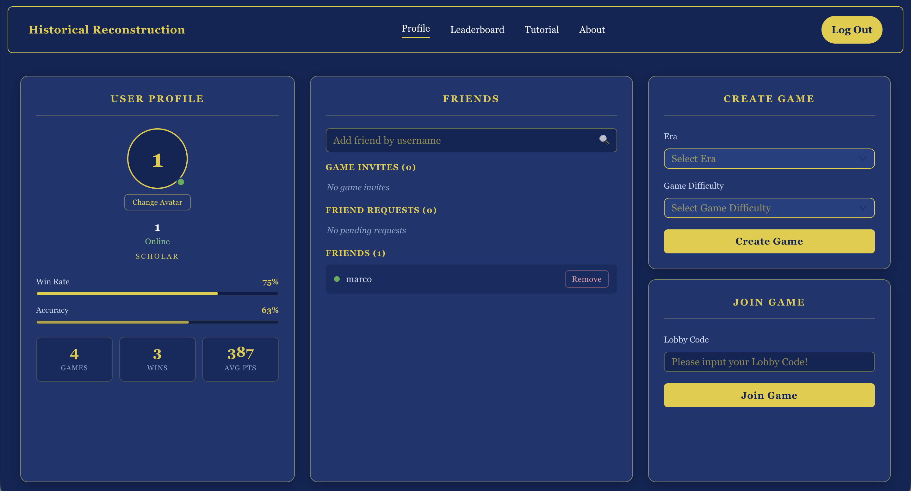
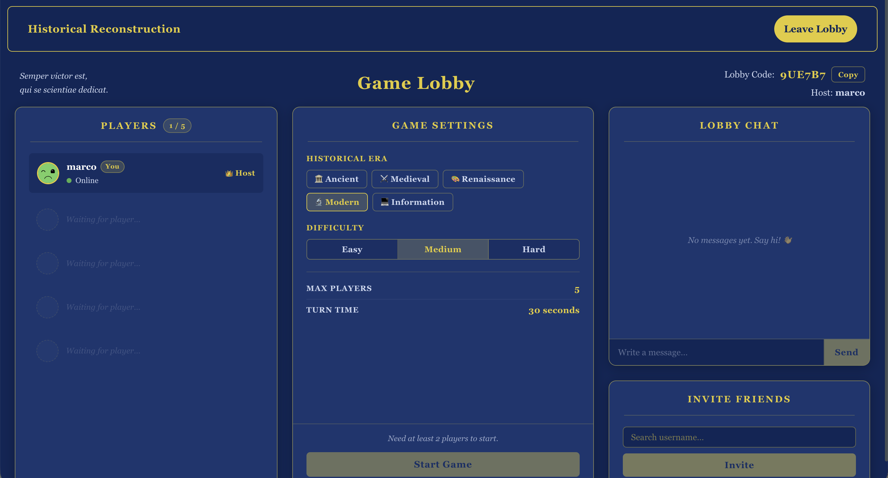
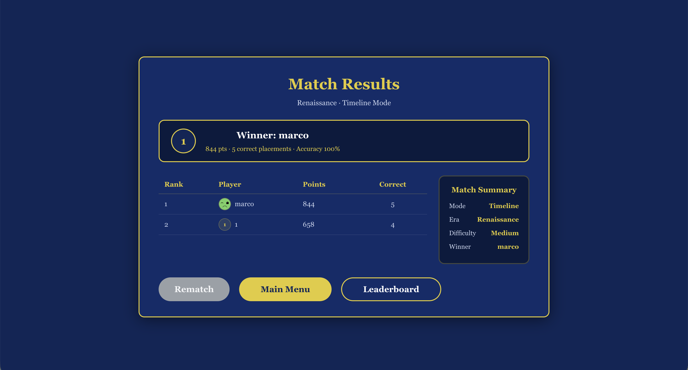
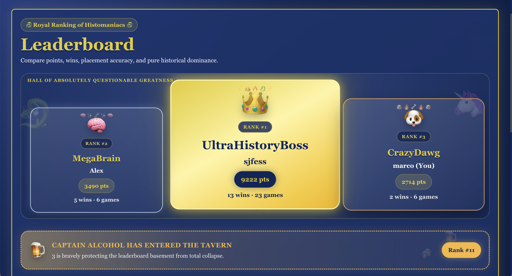

# Historical Reconstruction: Client-Side

## Introduction

Historical Reconstruction is a multiplayer web application where players compete by placing historical event cards in the correct chronological order. 
This repository contains the **frontend client**: a Next.js single-page application that lets players register, join lobbies, chat with teammates, 
place event cards on a shared timeline, view results, and track their standing on the leaderboard. 
It communicates with the [Spring Boot backend](https://github.com/sjfess/sopra-fs26-group-31-server) via a RESTful API. 
It was developed as part of the Software Engineering Lab (SoPra) at the University of Zurich during the spring semester of 2026.

## Technologies

- [Next.js 15](https://nextjs.org/), React framework with the App Router
- [React 19](https://react.dev/), UI library
- [TypeScript](https://www.typescriptlang.org/), Programming language
- [Ant Design 6](https://ant.design/), UI component library
- [Deno](https://deno.com/) and [Node.js](https://nodejs.org/), JavaScript runtimes
- [Vitest](https://vitest.dev/), Unit and component testing framework
- [Vercel](https://vercel.com/), Cloud deployment platform
- [Determinate Nix](https://determinate.systems/), Reproducible development environment

## High-Level Components

1. **[`apiService.ts`](app/api/apiService.ts)** The central HTTP client used by every page and hook to talk to the backend. Wraps `fetch` with base-URL handling, JSON serialization, auth token injection, and unified error handling. The single integration point for all REST calls.
2. **[`useApi.ts`](app/hooks/useApi.ts)** A thin React hook that exposes the `ApiService` to components. Together with the helper hooks ([`useGameResults.ts`](app/hooks/useGameResults.ts), [`useGameDuration.ts`](app/hooks/useGameDuration.ts), [`useLeaveGame.ts`](app/hooks/useLeaveGame.ts), [`useLocalStorage.tsx`](app/hooks/useLocalStorage.tsx)) it forms the bridge between the UI and the server state.
3. **[`gamelobby/[lobbyId]/page.tsx`](app/gamelobby/[lobbyId]/page.tsx)** The lobby screen where players gather before a match starts. Handles ready states, lobby chat ([`GameChat.tsx`](app/gamelobby/[lobbyId]/GameChat.tsx)), host controls, and the transition into an active game.
4. **[`games/[gameId]/play/`](app/games/[gameId]/play)** The core gameplay view. Renders the shared timeline, the player's hand of event cards, and the placement interactions. This is where the central game loop happens on the client side.
5. **[`AppNavbar.tsx`](app/components/AppNavbar.tsx)** The persistent top-level navigation. Provides routing between the [profile](app/profile), [leaderboard](app/leaderboard), [tutorial](app/tutorial), and lobby screens, and works with [`PresenceHeartbeat.tsx`](app/components/PresenceHeartbeat.tsx) to keep the user's online status in sync with the backend.

## Illustrations

The main user flow follows the natural progression from sign-in to gameplay:

1. **Register / Login**: A new user creates an account on the [register page](app/register), or returning users sign in via the [login page](app/login). Authentication tokens are stored locally via [`useLocalStorage.tsx`](app/hooks/useLocalStorage.tsx).
2. **Home & Profile**: After login, users land on the [home page](app/page.tsx) where they can view their [profile](app/profile), manage friends, or read the [tutorial](app/tutorial).
3. **Lobby**: Users create or join a [game lobby](app/gamelobby/[lobbyId]). Inside the lobby they can chat ([`GameChat.tsx`](app/gamelobby/[lobbyId]/GameChat.tsx)), set themselves ready, and (as host) configure the round.
4. **Gameplay**: Once the host starts the match, players move to the [play view](app/games/[gameId]/play). On each turn they receive an event card and drag it into the correct position on the shared timeline. The server validates the placement and pushes the updated state back to all clients.
5. **Results**: At the end of the match, players are shown the [results screen](app/results) with their score and round breakdown.
6. **Leaderboard**: Persistent rankings are displayed on the [leaderboard page](app/leaderboard).

### Screenshots

#### Register



#### Login



#### Home



#### Profile



#### Lobby



#### Results



#### Leaderboard



## Launch & Deployment

### Prerequisites

- A POSIX-compatible terminal (macOS, Linux, or WSL2 on Windows)
- Git
- Either [Node.js](https://nodejs.org/) (≥ 18) **or** [Deno](https://deno.com/); both are installed automatically by the setup script

### Windows users (one-time setup)

Install WSL2 first. Download the [`windows.ps1`](./windows.ps1) script, open PowerShell **as administrator** in the folder containing it, and run:

```shell
C:\Windows\System32\WindowsPowerShell\v1.0\powershell.exe -ExecutionPolicy Bypass -File .\windows.ps1
```

Reboot when prompted, then open WSL/Ubuntu and continue with the steps below.
**Keep the repository on the WSL filesystem** (e.g. `/home/<user>/`); running it from `/mnt/c/` will be very slow.

### Installation

1. Clone the repository:

   ```bash
   git clone https://github.com/sjfess/sopra-fs26-group-31-client.git
   cd sopra-fs26-group-31-client
   ```

2. Run the setup script. It uses [Determinate Nix](https://determinate.systems/) and `direnv` to install Node.js, Deno, and all other required tools in a reproducible shell:

   ```bash
   source setup.sh
   ```

   If anything goes wrong, see the manual fallback steps for installing Nix, `direnv`, and running `direnv allow` inside the repo.

### Available commands

The project can be driven with either runtime: substitute `npm run` for `deno task` if you prefer Node.

#### Run (development)

```bash
deno task dev
```

Starts the app on [http://localhost:3000](http://localhost:3000) with live reloading.

#### Build

```bash
deno task build
```

Produces an optimized production build.

#### Run (production)

```bash
deno task start
```

Serves the previously built production bundle on [http://localhost:3000](http://localhost:3000).

#### Lint & Format

```bash
deno task lint
deno task fmt
```

Run `deno task fmt` before every push to keep formatting consistent.

#### Test

```bash
deno task test
```

Runs the [Vitest](https://vitest.dev/) suite. Test coverage is tracked via [SonarQube](https://sonarcloud.io/) through [`.github/workflows/sonarcloud.yml`](.github/workflows/sonarcloud.yml).

### Backend dependency

The client requires the [Spring Boot backend](https://github.com/sjfess/sopra-fs26-group-31-server) to function. In local development the backend is expected at `http://localhost:8080`; in production the deployed App Engine instance is used. The base URL is resolved in [`app/utils/domain.ts`](app/utils/domain.ts) and [`app/utils/environment.ts`](app/utils/environment.ts).

### Deployment (Vercel)

All pushes to `main` automatically trigger the deployment workflow in [`.github/workflows/verceldeployment.yml`](.github/workflows/verceldeployment.yml), which:

1. Installs dependencies
2. Deploys the production build to Vercel

To trigger a release manually, push a tagged commit to `main`:

```bash
git tag M#
git push origin M#
```

Ensure the following GitHub repository secrets are configured:
- `VERCEL_TOKEN`
- `VERCEL_ORG_ID`
- `VERCEL_PROJECT_ID`
- `SONAR_TOKEN`

## Roadmap

Top features that new contributors could add:

1. **Real-time updates via WebSockets / SSE**: Replace the current polling-based hooks in [`app/hooks/`](app/hooks) with a push-based connection so lobby state, chat messages, and timeline updates arrive without repeated client requests.
2. **Drag-and-drop polish and mobile support**: Improve the timeline placement interaction in [`app/games/[gameId]/play`](app/games/[gameId]/play) with better touch support, animations, and accessibility for screen readers.

## Authors and Acknowledgment

- Alex Wimmer ([AlexWimmer 1](https://github.com/AlexWimmer1))
- Arthur Maximilian Sandor Csaky-Pallavicini ([milchazor](https://github.com/milchazor))
- Colin Kreienbühl ([Fanelock](https://github.com/Fanelock))
- Marco Büchel ([marcokingo](https://github.com/marcokingo))
- Samuel Jonas Fessler ([sjfess](https://github.com/sjfess))

We thank our TA and the Software Engineering Lab teaching team for their guidance throughout the course.

## License
Copyright 2026 Sopra-FS26-Group-31
This project is licensed under the Apache License 2.0. See the [LICENSE](https://github.com/sjfess/sopra-fs26-group-31-client/blob/main/LICENSE) file for details.
